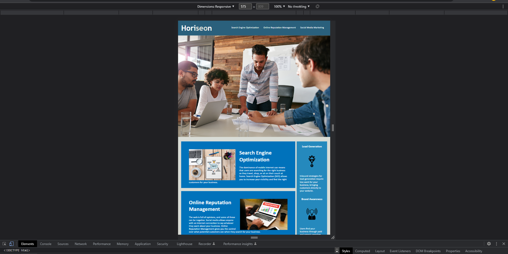

# Code Refactor Starter Code

## Description

Provide a short description explaining the what, why, and how of your project. Use the following questions as a guide:

- What was your motivation?
- Why did you build this project? (Note: the answer is not "Because it was a homework assignment.")
- What problem does it solve?
- What did you learn?

## Table of Contents (Optional)

If your README is long, add a table of contents to make it easy for users to find what they need.

- [Installation](#installation)
- [Usage](#usage)
- [Credits](#credits)
- [License](#license)

## Acceptance Criteria

Repository follows best practices for file structure and naming conventions.

Repository follows best practices for class/id naming conventions, indentation, quality comments, etc.

Repository contains multiple descriptive commit messages.

Repository contains a quality README file with description, screenshot, and link to deployed application.

Application's links all function correctly.

Application's CSS selectors and properties are consolidated and organized to follow semantic structure.

Application's CSS file is properly commented.

## Installation

What are the steps required to install your project? Provide a step-by-step description of how to get the development environment running.

## Usage

Provide instructions and examples for use. Include screenshots as needed.

To add a screenshot, create an `assets/images` folder in your repository and upload your screenshot to it. Then, using the relative filepath, add it to your README using the following syntax:

    ```md
    
    ```

## Credits

List your collaborators, if any, with links to their GitHub profiles.

If you used any third-party assets that require attribution, list the creators with links to their primary web presence in this section.

If you followed tutorials, include links to those here as well.

It is your responsibility to include a note in the README section of your repo specifying code source and its location within your repo. This applies if you have worked with a peer on an assignment, used code in which you did not author or create sourced from a forum such as Stack Overflow, or you received code outside curriculum content from support staff such as an Instructor, TA, Tutor, or Learning Assistant. This will provide visibility to grading staff of your circumstance in order to avoid flagging your work as plagiarized.

## License

The last section of a high-quality README file is the license. This lets other developers know what they can and cannot do with your project. If you need help choosing a license, refer to [https://choosealicense.com/](https://choosealicense.com/).

## Features

If your project has a lot of features, list them here.